# Consultant Training

Welcome to our consultant training site! We are excited to embark on this journey together as we explore the ins and outs of consultancy and develop the skills necessary to excel in this dynamic field.

Consultants play a crucial role in helping organisations solve complex problems, improve performance, and achieve their goals. Whether you're a seasoned professional looking to enhance your expertise or someone new to the world of consulting, this user-friendly training site will provide you with valuable insights, practical strategies, and hands-on experience to thrive in various consulting environments.

<a href="https://consultant-training-90d7ed762f2a.herokuapp.com/">View our Consultant Training site here.</a>

## UX Design

### Project Goals
The project goals of the consultant training site revolves around providing a user-friendly platform for individuals or organisations to access high-quality training resources, develop essential consulting skills, and advance their careers in the consulting industry. 

### Agile Methodology
Kanban Agile Methodology was used to write users stories, prioritize, and manage the backlog on GitHub board. 

No Epics were written as the stories were not large enough.
User stories were written to cover the site functionality.
The Project Board is set to public.
The Project Board was used to track progression of the tasks through the Todo, In progress, and Done columns.

<a href="https://github.com/users/moflynn23/projects/3/views/1?layout=board">The Kanban board and user stories can be found here.</a>

### Types of Users

#### First time user
Simple and intuitive website navigation for easy exploration and discovery.
Informative content providing an overview of schedules and bookings.
- User-friendly forms with clear validation messages to ensure accurate input.
- Easy Registration process.

#### Registered User
- Seamless login process with a secure and personalized user account.
- Browsing available schedules.
- Ability to book training.

#### Admin user
- Secure and separate login portal for admin users with appropriate access control.
- Access to an admin dashboard for managing users, schedules, and bookings.
- Ability to add, edit, or delete users, schedules, and bookings.

### Wireframes

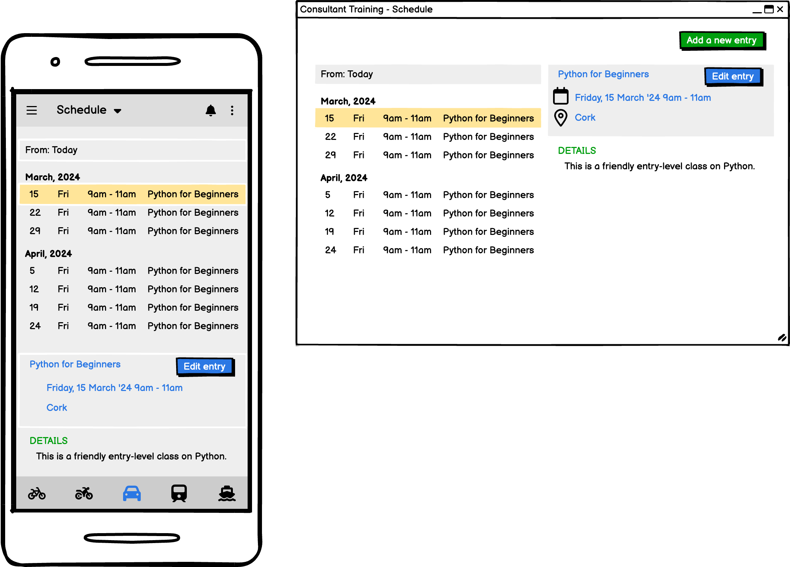

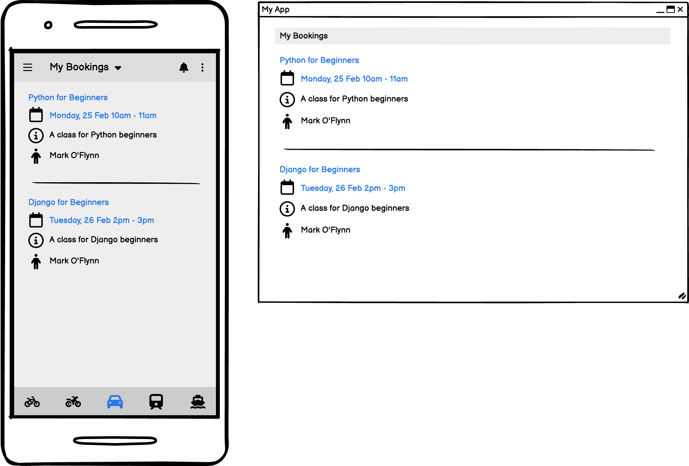

### Data Models

#### User Model
- Django Allauth, the User model is the default user model provided by the Django authentication system.
- The User entity has a one-to-many relationship with the Schedule and Booking entities. This means that a User can have multiple Schedules and Bookings, but each Schedule and Booking is associated with only one User.

#### Schedule Model
- Admin can add multiply schedules in Schedule model. So users can see the schedules and the relevent information on schedule list page.
- Only Admin can change the data.
- User can see the schedule information.
- Information provided is schedule title, created by & date time, schedule dates and times, location and further details.
- Schedule model has many to many relationship with Booking model. Therefore, each schedule offered on the platform can be booked by multiple users. This reflects the idea that a schedule can have numerous participants or bookings. Conversely, each booking made by a user can be associated with multiple schedules. This means that a user can enroll in or book multiple schedules.

#### Booking Model
- A User can have multiple bookings, but each booking is associated with only one User. This is represented by the foreign key relationship between User and Booking.
- Each user can book as many schedules as they would like.
- User can book a course multiple times. This is a known bug and will be resolved in a future phase.

### Database Schema

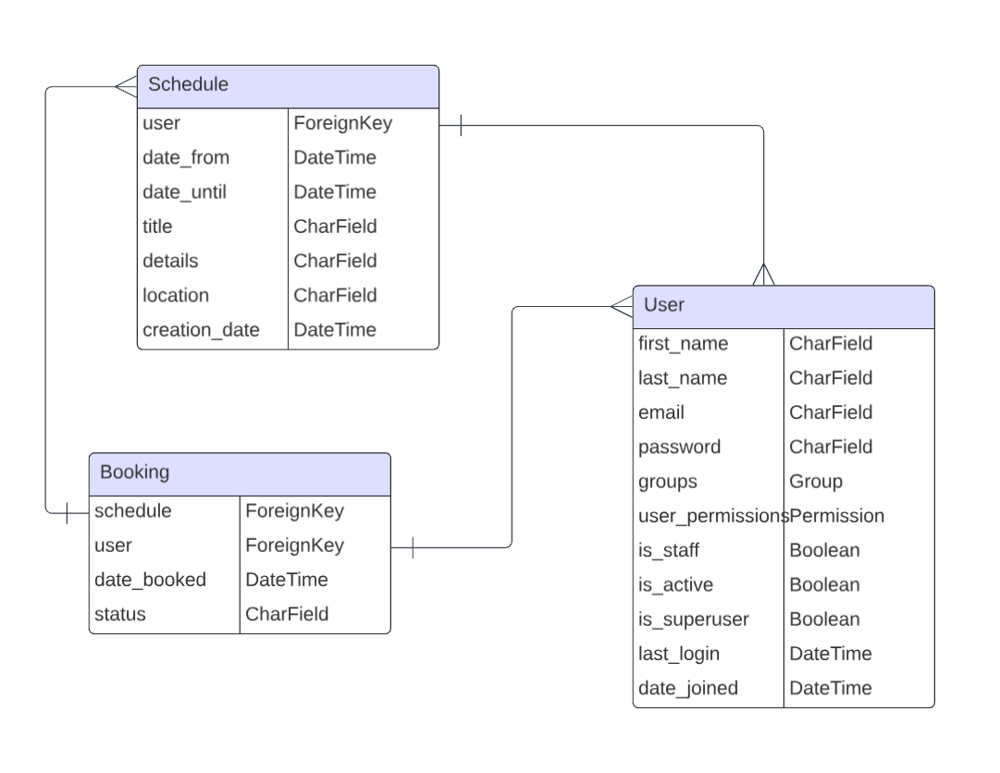

## Features

### Existing Features
#### Landing Page

This is the page a user lands on when arriving at the site for the first time or before they've logged in if they don't have an active session. The nav bar gives them the option to either sign up for an account or sign in to an existing account.

#### Sign Up Page

This is where the user can create an account for themselves by entering their e-mail address, desired username and password twice to confirm. 

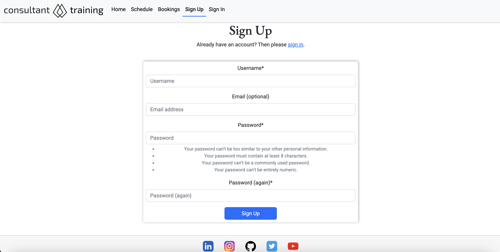

#### Sign In Page

This is where users with existing accounts can log in with either their username and password. They can choose to let their browser remember them if they plan on returning to the site on the same device to avoid having to log in again. If the user forgets their password they can click the link to reset it.

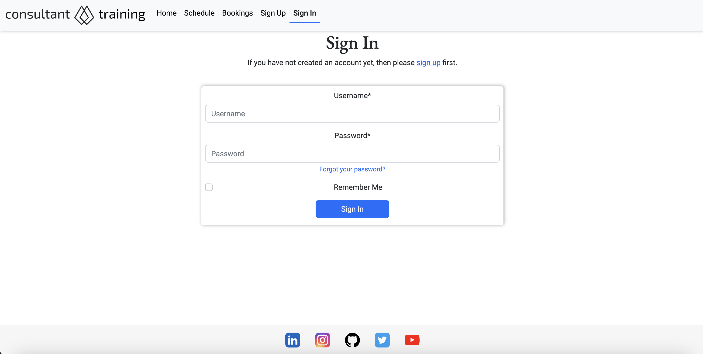

#### Nav Menu

The nav menu contains everything the user will need to navigate the site. From the nav menu when a user is logged in, users can view the schedule, view the bookings, and sign out. Users not logged in can still view the schedule and bookings, but will have the options to sign up or sign in.

#### Footer

The footer appears across the website and includes social icons to LinkedIn, Instagram, GitHub, Twitter, and Youtube. For now the user is redirected to the login pages.

#### Add a Schedule

Adding a schedule couldn't be easier. The date time picker is presented to the user for the date range fields. All form fields are required. 

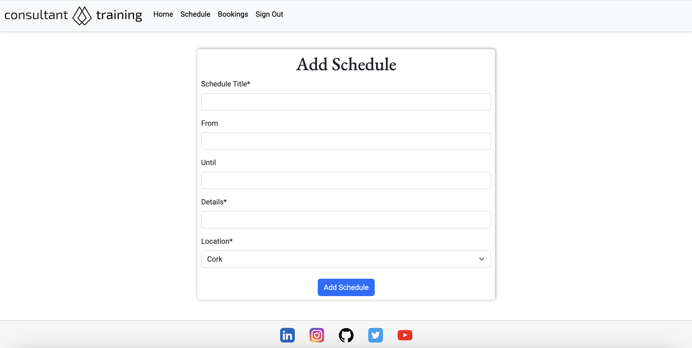

#### View Schedules

The list of schedules are visible on the schedule page. Only the date & time, and title which is clickable are shown.

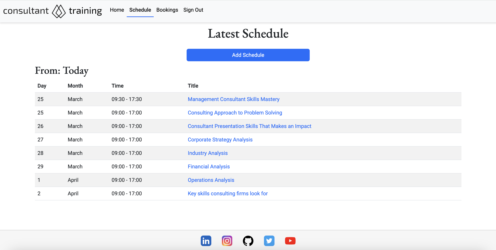

#### Edit a Schedule

Schedules can be modified by the admin only. All fields can be modified.

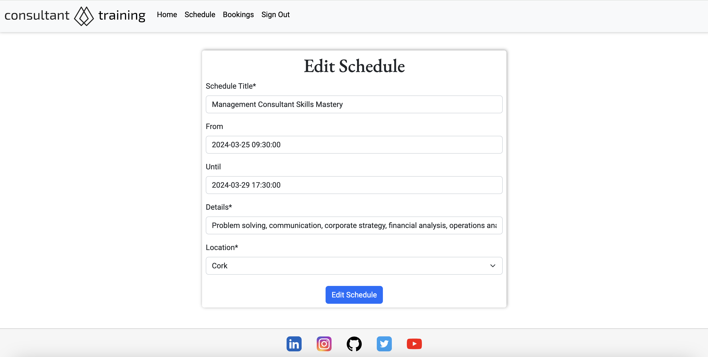

#### Delete a Schedule

Schedules can be deleted accordingly by the admin only. The user is required to confirm in the event the delete button is clicked accidentally.

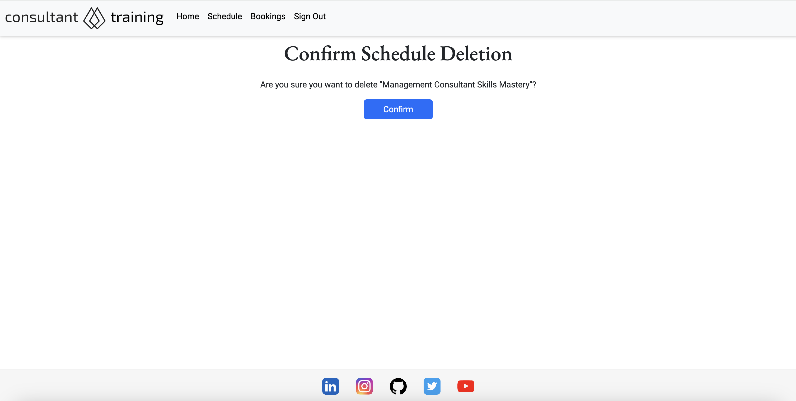

#### Add a Booking

Making a booking is done by the simple click of a button. Users can browse the schedules and sign up as they wish.

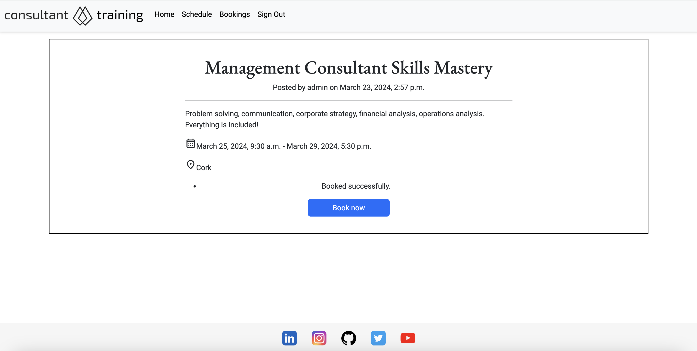

#### View Bookings

All bookings are listed on the bookings page.

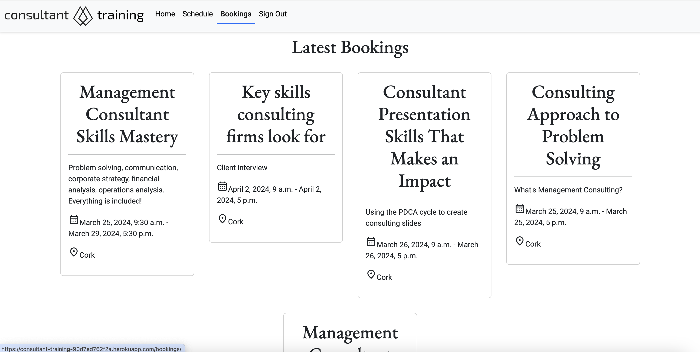

## Technologies

### Languages Used
- HTML5
- CSS
- JavaScript
- Python

### Databases Used
- ElephantSQL - Postgres database
- Cloudinary

### Frameworks Used
- Django - Python framework
- Bootstrap 5.3.2 - CSS framework

### Programs Used
- Github
- Gitpod
- Heroku
- Google Fonts
- Git version control
- Favicon Generator
- JSHint
- W3C Markup Validation Service
- CSS Validation Service

## Manual Testing

### Responsiveness

The site's responsiveness was tested across multiple devices (phone, tablet, laptop).

### Browser compatibility

The following browser's were used to test browser compatibility:
- Google Chrome
- Firefox
- Safari

### Security Features

#### User Authentication
- Django Allauth is a popular authentication and authorization library for Django, which provides a set of features for managing user authentication, registration, and account management.
#### CSRF Protection
- Django provides built-in protection against Cross-Site Request Forgery (CSRF) attacks. CSRF tokens are generated for each user session, and they are required to submit forms or perform state-changing actions. When a user logs out, the session and associated CSRF token are invalidated, making it difficult for an attacker to forge a valid request using a copied URL.
#### Custom error pages
- 404 Error Page, provides user with a button the redirect to home page.

### Code validation

#### HTML5 Validation

I used [W3C Markup Validation](https://validator.w3.org/) to validate my HTML5 code from all templates used in the project.

Apart from some information messages, there was only one error that there must be only one main element.

#### CSS Validation

I used [W3C CSS Validation](https://jigsaw.w3.org/css-validator/) to validate the CSS code from my custom stylesheet.

There were no errors in the code to resolve, but 319 warnings. 

### User Story tests

| Page         | Action                      | Expected outcome                                            | Pass/Fail   |
|--------------|-----------------------------|-------------------------------------------------------------|-------------|
| Home | Click 'Home' from nav bar | Home page is displayed | Pass        |
| Home | Click 'Sign Up' from nav bar | Sign Up form is displayed | Pass        |
| Sign Up | Click 'Sign Up' | Username must be filled out | Pass        |
| Sign Up | Enter username and click 'Sign Up' | Password must be filled out | Pass        |
| Sign Up | Enter username, password and click 'Sign Up' | Password (again) must be filled out | Pass        |
| Sign Up | Enter mandatory fields and click 'Sign Up' | Account is created | Pass        |
| Home | Click 'Sign In' from nav bar | Sign In form is displayed | Pass        |
| Sign In | Enter required details and click 'Sign In' | User is logged in | Pass        |
| Home | Click 'Schedule' from nav bar | Schedule form is displayed | Pass        |
| Schedule | Click 'Add Schedule' | Add Schedule form is displayed | Pass        |
| Add a Schedule | Fill in all required fields and click 'Add Schedule' | Redirected to Schedule and schedule is listed | Pass        |
| Schedule | Click on Title link | Schedule details are displayed | Pass        |
| Home | Click 'Bookings' | Bookings listed are displayed | Pass        |
| Home | Click Linked In icon | Open Linked In in new tab | Pass        |
| Home | Click Instagram icon | Open Instagram in new tab | Pass        |
| Home | Click GitHub icon | Open GitHub in new tab | Pass        |
| Home | Click Twitter icon | Open Twitter in new tab | Pass        |
| Home | Click YouTube icon | Open YouTube in new tab | Pass        |
| Home | Click Consultant Training logo | Home page is displayed | Fail        |
| Sign Out | Click 'Sign Out' from nav bar | User is logged out | Pass        |

### Bugs resolved

- Build failed on Heroku deployment due to runtime error
- Duplicate "Forgot password" links on Sign In page

### Bugs unresolved

- Error on password reset submission
- Messages show on viewing a schedule

## Deployment

### Local Developement
#### How to Fork
- Log in(or Sign Up) to Github
- Go to repository for this project <a href="https://github.com/moflynn23/consultant-training">consultant-training</a>
- Click the fork button in the top right corner
#### How to Clone
- Log in(or Sign Up) to Github
- Go to repository for this project <a href="https://github.com/moflynn23/consultant-training">consultant-training</a>
- Click on the code button, select whether you would like to clone with HTTPS, SSH or GitHub CLI and copy the link shown.
- Open the terminal in your code editor and change the current working directory to the location you want to use for the cloned directory.
- Type the following command in the terminal (after the git clone you will need to paste the link you copied in step 3 above)
- Set up a virtual environment (this step is not required if you are using the Code Institute Template in GitPod as this will already be set up for you).
- Install the packages from the requirements.txt file - run Command pip3 install -r requirements.txt
#### ElephantSQL Database
ElephantSQL is using as PostgreSQL Database as follow:

- Click Create New Instance to start a new database.
- Provide a name (this is commonly the name of the project: tribe).
- Select the Tiny Turtle (Free) plan.
- You can leave the Tags blank.
- Select the Region and Data Center closest to you.
- Once created, click on the new database name, where you can view the database URL and Password.
#### Cloudinary
Cloudinary is used as a cloud to store images:

- For Primary interest, you can choose Programmable Media for image and video API.
- Optional: edit your assigned cloud name to something more memorable.
- On your Cloudinary Dashboard, you can copy your API Environment Variable.
- Be sure to remove the CLOUDINARY_URL= as part of the API value; this is the key.
#### Heroku Deployment
- Log into Heroku account or create an account.
- Click the "New" button at the top right corner and select "Create New App".
- Enter a unique application name
- Select your region
- Click "Create App"
#### Prepare enviroment and settings.py
- In your GitPod workspace, create an env.py file in the main directory.
- Add the DATABASE_URL value and your chosen SECRET_KEY value to the env.py file.
- Update the settings.py file to import the env.py file and add the SECRETKEY and DATABASE_URL file paths.
- Comment out the default database configuration.
- Save all files and make migrations.
- Add the Cloudinary URL to env.py
- Add the Cloudinary libraries to the list of installed apps.
- Add the STATIC files settings - the url, storage path, directory path, root path, media url and default file storage path.
- Link the file to the templates directory in Heroku.
- Change the templates directory to TEMPLATES_DIR
- Add Heroku to the ALLOWED_HOSTS list the format ['app_name.heroku.com', 'localhost']
#### Add the following Config Vars in Heroku
- SECRET_KEY - This can be any Django random secret key
- CLOUDINARY_URL - Insert your own Cloudinary API key
- PORT = 8000
- DATABASE_URL - Insert your own ElephantSQL database URL here
#### Heroku needs two additional files to deploy properly
- requirements.txt
- Procfile
#### Deploy
- Make sure DEBUG = False in the settings.py
- Go to the deploy tab on Heroku and connect to GitHub, then to the required repository.
- Scroll to the bottom of the deploy page and either click Enable Automatic Deploys for automatic deploys or Deploy Branch to deploy manually. Manually deployed branches will need re-deploying each time the GitHub repository is updated.
- Click 'Open App' to view the deployed live site.

## References

### Content
- Background image was downloaded from https://wallpapers.com/consultant#google_vignette
- Logo was created from https://favicon.io/logo-generator/

### Acknowledgments
- Code Institute LMS walkthroughs
- Kevin Loughrey's Django and Heroku setup videos
- Django recipe sharing tutorial
- Code Institute coaches
